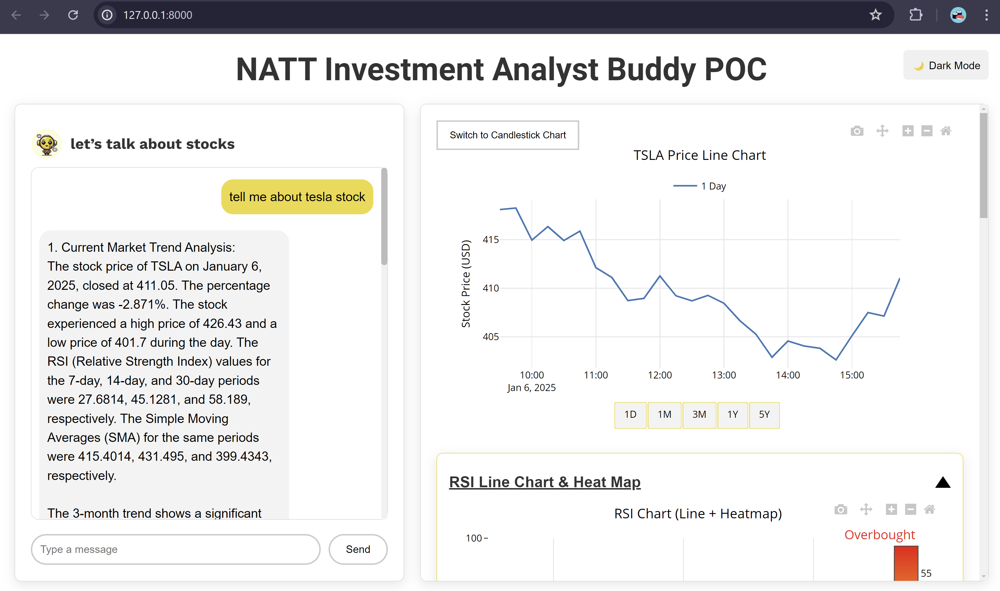
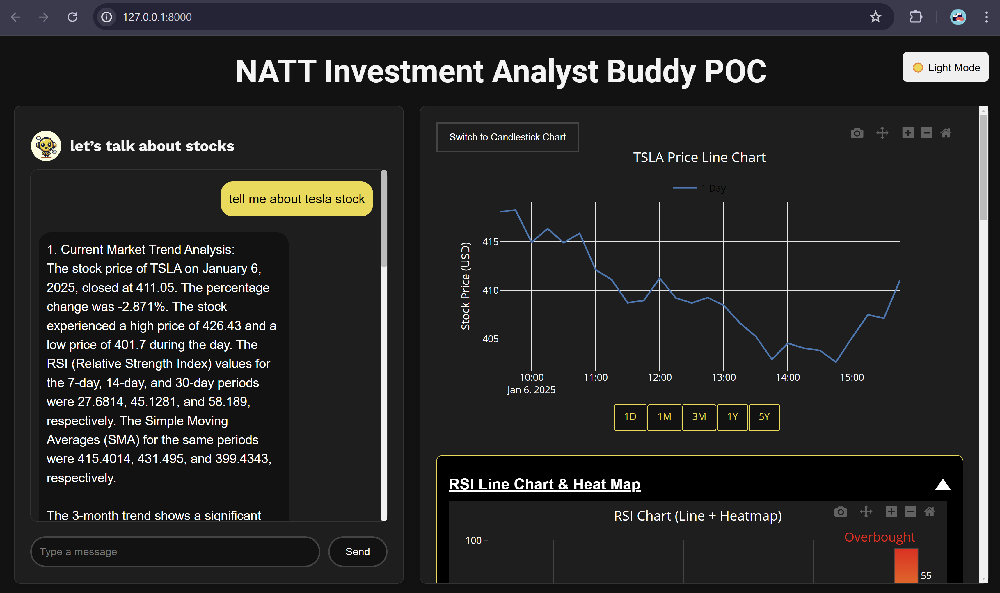

# CSS Documentation

I have used Vanilla CSS to create the desired layout for the web application, supporting both light and dark modes. It is a plain CSS without using any frameworks like Bootstrap or Tailwind.

Vanilla CSS provides full control over styling, and it is lightweight, and allows for unique, custom designs. However, it can be time-consuming to write everything from scratch, may lead to repetitive code, and lacks pre-built features like responsive grids and utilities offered by frameworks. It’s ideal for custom, lightweight projects like prototyping and proof of concepts but can be challenging for large or complex designs.

## Overview
This css file which reside under statics/css defines the styles for NATT Investment Analyst Buddy, including layout, typography, and theme-specific (light and dark mode) adjustments.

## Table of Contents
- [Global Styles](#global-styles)
- [Typography](#typography)
- [Layout Containers](#layout-containers)
- [Chart and News Section](#chart-and-news-section)
- [Buttons](#buttons)
- [Chat Bubbles](#chat-bubbles)
- [Web Application Layout](#Web-Application-Layout)

---

### Global Styles

These example styles apply to the entire page and control overall appearance, including light and dark mode transitions.

```css
/* Global body styles */
body {
  font-family: "Arial", sans-serif;
  margin: 0;
  padding: 20px;
  background-color: #ffffff; /* Default light background */
  color: #333; /* Default text color */
  transition: background-color 0.3s ease, color 0.3s ease;
  overflow: hidden; /* Prevent scrolling */
}

/* Dark mode styles for the body */
body.dark-mode {
  background-color: #121212; /* Dark mode background */
  color: #f4f4f4; /* Dark mode text color */
}
```

---

### Header , Title and Text Styles

Defines the appearance of headings and other text elements.

```css
/* Header (h1) styles */
h1 {
  text-align: center;
  margin-top: auto;
  margin-bottom: 20px;
  font-size: 2.5rem;
  font-family: "Roboto", sans-serif;
}
```

---

### Layout Containers

Defines the overall structure and layout of the page, such as the chat container and the chart/news section.

#### Main Container
```css
/* Main container styles */
.container {
  display: flex;
  width: 100%;
  margin: auto;
  height: calc(100vh - 60px);
}
```

#### Chat Container
```css
/* Chat container styles */
#chat-container {
  display: flex;
  flex-direction: column;
  height: 87%;
  width: 40%;
  padding: 20px;
  background: #ffffff;
  border: 1px solid #ddd;
  border-radius: 8px;
  box-shadow: 0 4px 15px rgba(0, 0, 0, 0.1);
  margin-right: 20px;
  overflow: hidden;
}

/* Dark mode chat container */
body.dark-mode #chat-container {
  background: #1e1e1e;
  border: 1px solid #333;
}
```

#### Chart and News Section
```css
#chart-news-container {
  width: 60%;
  height: 87%;
  padding: 20px;
  background: #ffffff;
  border: 1px solid #ddd;
  border-radius: 8px;
  box-shadow: 0 4px 15px rgba(0, 0, 0, 0.1);
  overflow: auto;
  position: relative;
}

/* Dark mode chart and news container */
body.dark-mode #chart-news-container {
  background: #1e1e1e;
  border: 1px solid #333;
}
```

---

### Buttons

This section snippplet describes the styles for various buttons, including hover and focus effects.

#### Submit Button
```css
/* Default submit button styles */
#submit-btn {
  padding: 10px 20px;
  background-color: transparent;
  color: #000000;
  border: 2px solid #cccccc;
  border-radius: 20px;
  cursor: pointer;
  transition: background-color 0.3s ease, color 0.3s ease, border-color 0.3s ease;
}

/* Hover effect */
#submit-btn:hover {
  background-color: #f4da40;
  color: rgb(0, 0, 0);
  border-color: #ffffff;
}

/* Dark mode styles */
body.dark-mode #submit-btn {
  color: #ffffff;
  border-color: #444;
  background-color: #121212;
}
```

---

### Chat Bubbles

Defines the appearance of chat messages for users and bots, with separate styles for light and dark modes.

The response bubbles from bot are also anchored in a way that user is able to receive the information effortlessly.

```css
/* Base chat message styles */
.chat-message {
  display: flex;
  flex-direction: column;
  max-width: 70%;
  padding: 10px;
  border-radius: 10px;
  margin: 5px 0;
  font-size: 0.9rem;
  line-height: 1.5;
}

/* User message bubble */
.sent {
  background-color: #dcf8c6;
  align-self: flex-end;
  border-bottom-right-radius: 0;
}

/* Bot message bubble */
.received {
  background-color: #ffffff;
  align-self: flex-start;
  border-bottom-left-radius: 0;
}

/* Dark mode bot bubble */
body.dark-mode .bot-bubble {
  background-color: #121212;
  color: #fff;
}
```

---

### Additional Features

#### Scrollbars
Styling for scrollbars in both light and dark modes.

```css
#chart-news-container::-webkit-scrollbar {
  width: 8px;
}

#chart-news-container::-webkit-scrollbar-track {
  background: #f1f1f1;
}

#chart-news-container::-webkit-scrollbar-thumb {
  background: #bcbcbc;
  border-radius: 10px;
}

body.dark-mode #chart-news-container::-webkit-scrollbar-thumb {
  background: #747474;
}
```

### Web Application Layout

The desired layout is achieved through a combination of HTML structure, inline & separate styling, and JavaScript-based styling for dynamic adjustments.

#### Web Application Example Layout Light Mode
=

#### Web Application Example Layout Dark Mode
