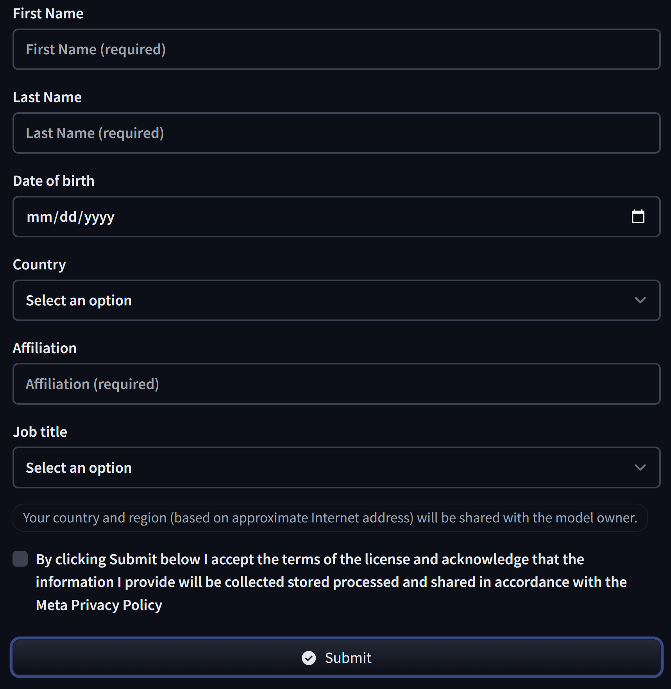

# LLM Model Integration Setup

## 1 . Model Request

To integrate the language model into our web application, we have two options: hosting the model locally or utilizing the Hugging Face API. Hosting the model locally requires significant computational resources, while using the Hugging Face API offers a more resource-efficient solution.

### Step 1. Create an Access Token

To begin using the Hugging Face API, we need to generate an access token for authentication. This token will allow us to interact with the Hugging Face Hub and perform actions based on the permissions granted by the token.

Navigate to : https://huggingface.co/settings/tokens

Create a new token for application usage. 

### Step 2. Request Access to the Model 

Once the access token is created, the next step is to request access to the desired model. You can do so by following the process shown in the image below:

For this project, https://huggingface.co/mistralai/Mistral-7B-Instruct-v0.2 has been selected, let's navigate there and request for access. 

Link: https://huggingface.co/mistralai/Mistral-7B-Instruct-v0.2



### Step 3.Verify Model Availability 

After submitting the access request, you can check the status of your model access. If the request is approved, you can verify the model's availability by visiting the following link: https://huggingface.co/settings/gated-repos

Once access is granted, let's proceed to integrate the model into NATT Investment Analyst Buddy Web Application.

## 2 . API for agents

The LLM model had been used for two agents , listed as
1)  information retriveal agent. 
2)  summerization agent of the financial data and generating response. 

### Saving The Token & Using It

#### Storing the Token
```
# In settings.py
HUGGINGFACE_API_KEY = "YOUR NEWLY CREATED HUGGINGFACE API KEY"
```

#### Utilizing the token for API calls
```
from huggingface_hub import InferenceClient

client = InferenceClient(api_key=settings.HUGGINGFACE_API_KEY)

# For example
stream = client.chat.completions.create(
                model="mistralai/Mistral-7B-Instruct-v0.2",
                messages=messages,
                temperature=0.0,  # Ensure deterministic behavior
                max_tokens=5,  # Restrict to a short length for symbol-only output
                top_p=0.7,
                stream=True,
            )
```

## 3 . Changing the model 

Before switching to a new model, it's important to verify that you have access to the model. You can check the status of the model and verify its availability by visiting the following link:

[Verify Model Availability on Hugging Face](https://huggingface.co/settings/gated-repos)

This page will show the list of models that you have access to, including any gated models that require special permissions.


Switching the model in your application is relatively simple. Once you have verified your access to the desired model, follow these steps to switch it:

```
stream = client.chat.completions.create(
                model="YOUR CHOICE OF MODEL(eg.gpt-3.5-turbo)", 
                # formerly  mistralai/Mistral-7B-Instruct-v0.2
                messages=messages,
                temperature=0.0,  # Ensure deterministic behavior
                max_tokens=5,  # Restrict to a short length for symbol-only output
                top_p=0.7,
                stream=True,
            )
```

## 4 . API Call Limits 

The Inference API on Hugging Face that the selected model resides has rate limits based on the number of requests. These rate limits are subject to change in the future to be compute-based or token-based.

Reference : https://huggingface.co/docs/api-inference/en/rate-limits 

