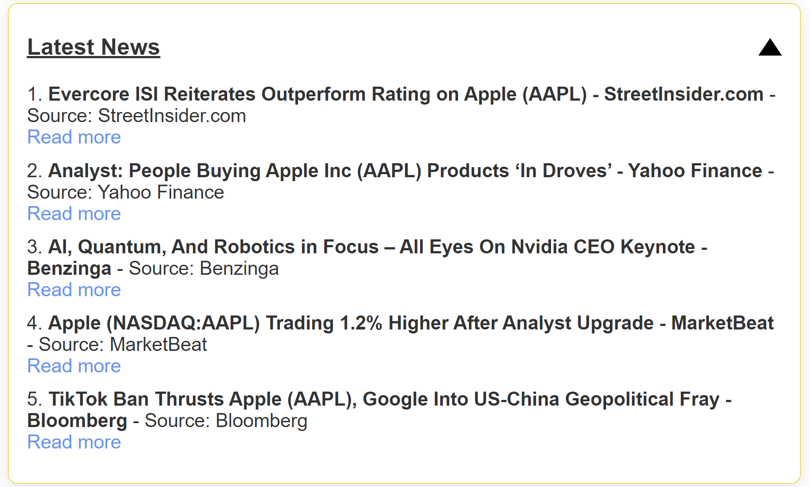

# Financial News

The `fetch_latest_news` function retrieves the latest news articles based on a search query which is constructed with the user prompt text obtained from front end and using Google News RSS feed. Default search query (`"technology"`) is set and the number of articles to fetect in this which 5.

## Function

```python
import urllib.parse
import feedparser

def fetch_latest_news(query: str = "technology", limit: int = 5):
    # Encode the query to handle spaces and special characters
    encoded_query = urllib.parse.quote(query)
    url = f"https://news.google.com/rss/search?q={encoded_query}&hl=en-US&gl=US&ceid=US:en"
    
    # Parse the feed
    feed = feedparser.parse(url)
    
    # Sort entries by the 'published' field in reverse order (latest first)
    sorted_entries = sorted(feed.entries, key=lambda entry: entry.published_parsed, reverse=True)
    
    # Return the top `limit` number of sorted news articles
    return [
        {
            "title": entry.title,
            "source": entry.source.title if 'source' in entry else 'Google News',
            "url": entry.link
        }
        for entry in sorted_entries[:limit]
    ]
```

The logic flow for fetching latest news using Google News RSS feed is as follow: 

1) Query Encoding:
The search query is encoded using urllib.parse.quote to handle spaces and special characters, ensuring the URL is correctly formatted.

2) RSS Feed Parsing:
The function sends a request to Google News’s RSS feed with the encoded query and parses the resulting XML feed using feedparser.

3) Sorting by Date:
The articles are sorted by the published date in reverse order (latest newsfirst).

4) Limit Results:
The function returns only the top 5 limit articles, based on the sorted order. We can modify the limit parameter to vary the number of article fetched. 

## Example Display 



