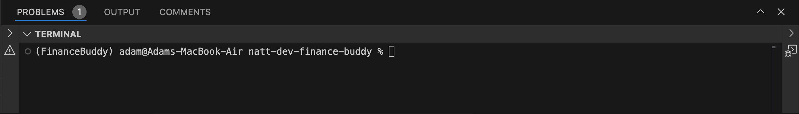
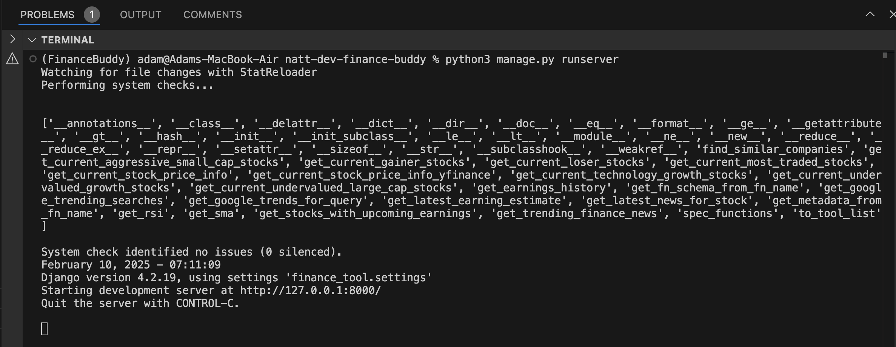
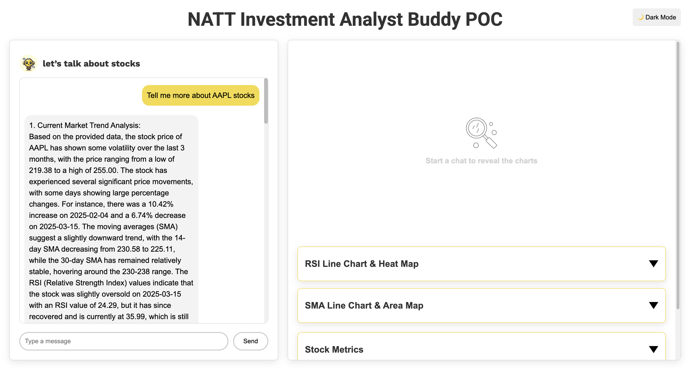

# Project Setup 
This project uses Python version 3.9.0 & Visual Studios IDE<br>
For information on Python version and installation, please refer to their documentation and website<br>
Python website : https://www.python.org/ <br>
Python Releases : https://www.python.org/downloads/ <br>
How To Install Python : https://wiki.python.org/moin/BeginnersGuide/Download <br>

1) To setup the project, first create a virtual environment to install the necessary packages.
2) Then, install the necessary packages.
3) Finally, run the Django project on the localhost.

## Create A Python Virtual Environment
Using the terminal or Command Prompt:
1) Navigate to the project root folder.

2) Once in the project root folder create the python environment with the following command :<br>
MacOS, Linux, & Windows :<br>
```python -m venv your_venv_name_of_choice``` or
```python3 -m venv your_venv_name_of_choice```<br>
This will create the new Python environment in the project root folder

3) Activate the new Python virtual environment,<br>
MacOS & Linux:<br>
```source your_venv_name_of_choice/bin/activate```<br>
Windows:<br>
```your_venv_name_of_choice\Scripts\activate```

4) To deactivate the Python virtual environment use the following command:<br>
MacOS, Linux, & Windows :<br>
```deactivate```<br>
But to run the project, the Python environment must remain activated.

## Installing Packages

In the project root folder contains a .txt file name ```requirements.txt``` containing the packages to run this project.<br>
These packages from the ```requirements.txt``` must be installed before running the project on the localhost url.

1) Using the terminal, or command prompt, start installing ```requirements.txt``` packages using the following command:<br>
MacOS, Linux, & Windows :<br>
```pip install -r requirements.txt ```<br>
Once the installation is completed, the project is ready to run.

## Run The Project

After creating and activating the Python environment, installing the necessary packages the project is ready to run and start the server.

1) Make sure the Python environment is ready and running, in this example the Python environment is ```(FinanceBuddy)```.<br>


2) In the project root folder where ```manage.py``` is located, type the following command in the terminal, or command prompt.<br>
MacOS, Linux, & Windows :<br>
```python manage.py runserver``` or ```python3 manage.py runserver```
3) The project's server should now be running, the image below is an example of when the server is running.<br>


4) Click the localhost URL or a URL you have chosen with this project, in this example it is ```http://127.0.0.1:8000/```.
5) Once you have entered the URL the project is ready for use, here is an example below.

