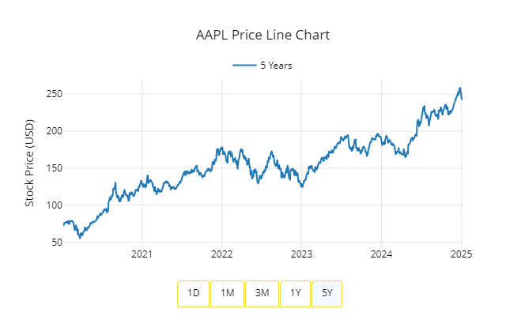
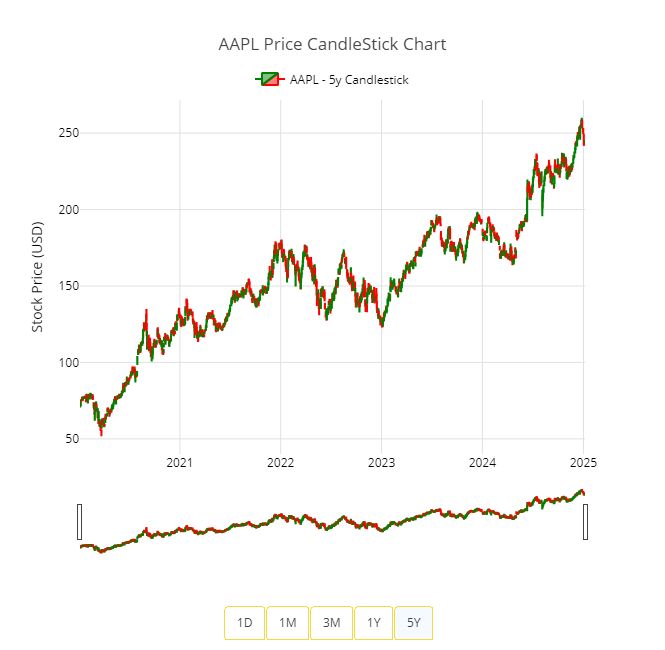
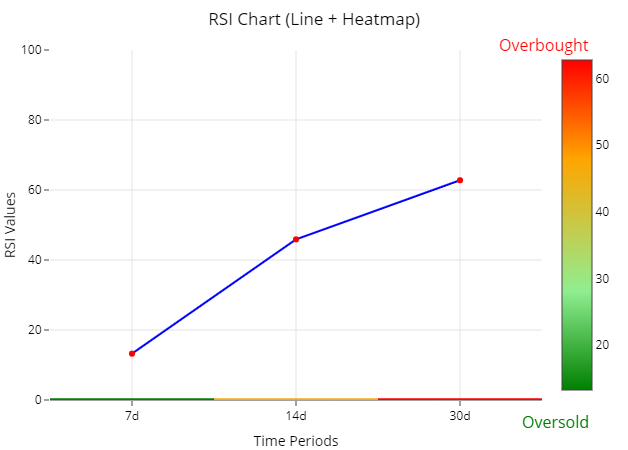
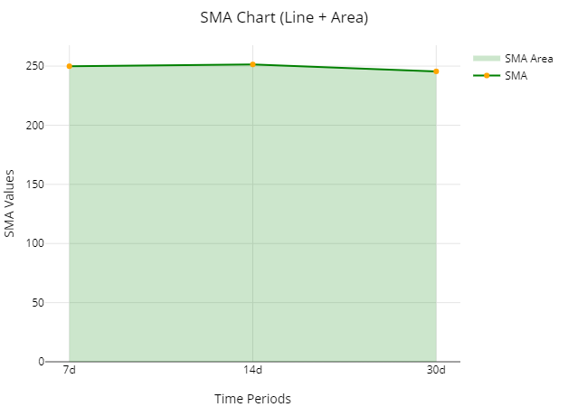
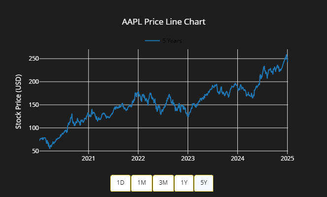
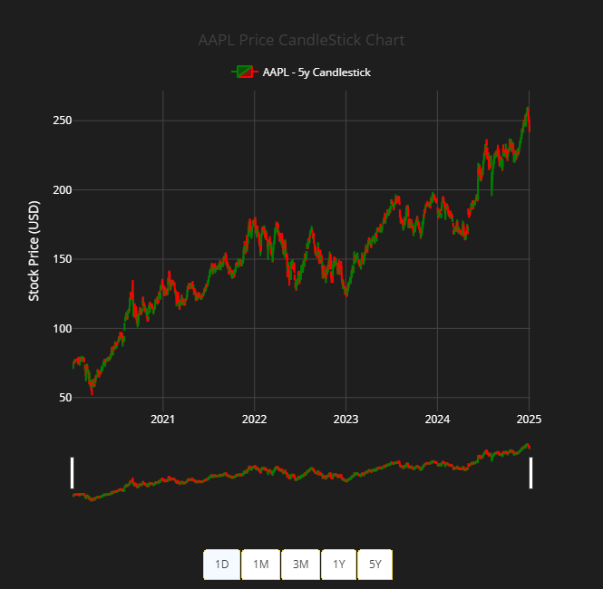
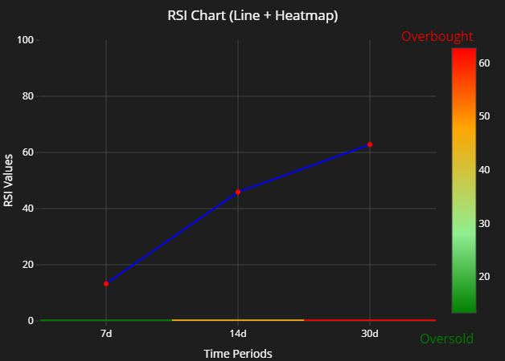
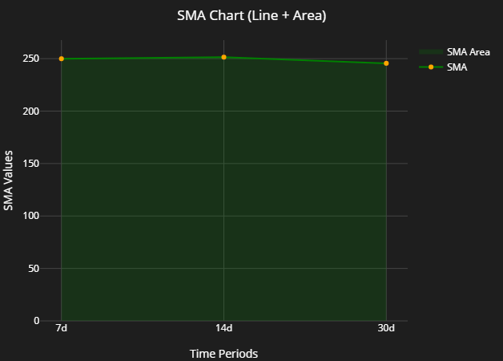

# Charts 

The following charts are shown as example of each certain types of charts are looks alike in light mode(default) and dark mode. 

The Line and CandleStick Charts are visualization 1day , 1month , 3months , 1year and 5years of historical financial data - stock prices. 

In the documented pictures below , it is been selected in 5 years , and a user can select menu buttons available to navigate accordingly. 

RSI and SMA charts data are calculated and visualized based on 7days, 14days and 30days worth of historical data.

All of the historical data are counted started from the latest business day. 

## Line Chart

A Line Chart displays the stock's closing price over time, helping users track the overall trend of the stock. It shows if the stock price is going up, down, or staying steady.

It helps users spot trends over time (e.g., over the past day, month, or year), which aids in decision-making about buying or selling.

## CandleStick Pattern Chart

A Candlestick Chart shows the stock's opening, closing, high, and low prices for each period. The "candles" help identify market patterns like bullish or bearish trends.

It provides more detailed information about daily price movements and helps traders predict future trends.

## RSI Line and HeatMap

The RSI Line measures the strength and speed of a stock’s price movement, indicating if it is overbought (above 70) or oversold (below 30). The Heatmap complements this by using color codes to visually highlight areas of overbought or oversold conditions.

## SMA Line and AreaMap

The SMA Line is the average closing price of a stock over a set period, smoothing out price fluctuations. The AreaMap visually represents the stock price relative to the SMA line, highlighting areas where the price is above or below the average.

## Light Mode Style Charts 

### Stock Historical Prices Line Chart

### Stock Historical Prices CandleStick Pattern Chart

### Stock Relative Strength Index (RSI) Line Chart & Heat Map

### Stock Simple Moving Average (SMA) Line Chart & Area Map

### Dark Mode Style Charts

### Stock Historical Prices Line Chart

### Stock Historical Prices CandleStick Pattern Chart

### Stock Relative Strength Index (RSI) Line Chart & Heat Map

### Stock Simple Moving Average (SMA) Line Chart & Area Map

Together, these charts provide powerful insights into the stock’s behavior, enabling users to make informed investment decisions.
