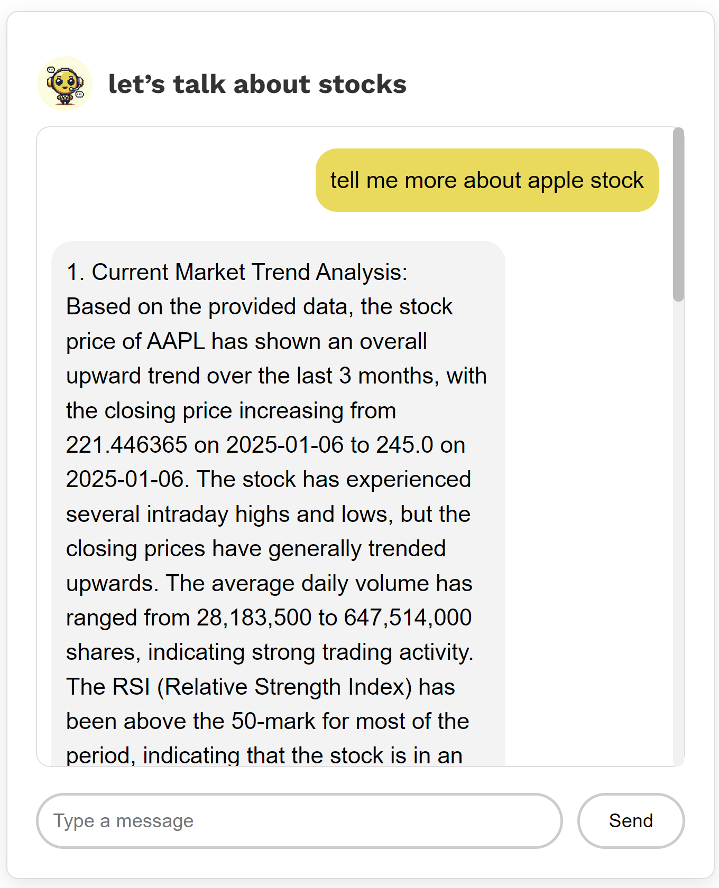
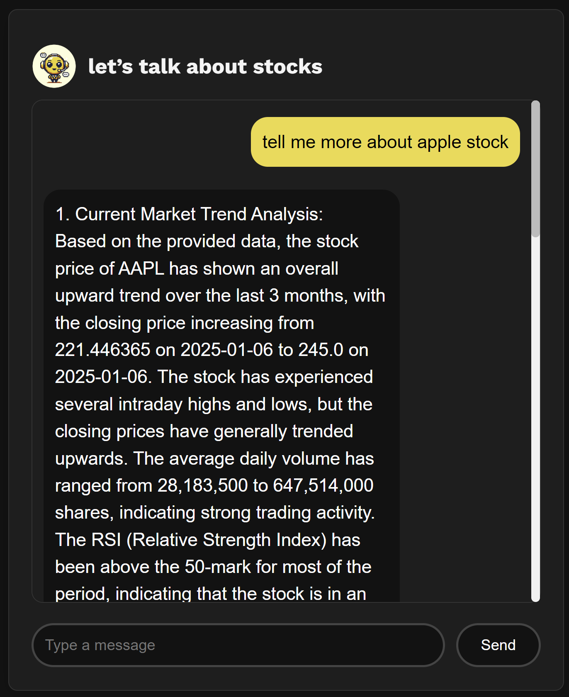

# Summerization Agent

## Prompt Construction 

```
full_prompt = f"""
            Analyze the stock situation of {stock_ticker}.
            
            Stock Price Details:
            - Date in Year/Month/Day Format {financial_data.get('Date', 'N/A')}
            - Current Price: {financial_data.get('Current Price', 'N/A')}
            - High Price of the Day: {financial_data.get('High Price of the day', 'N/A')}
            - Low Price of the Day: {financial_data.get('Low Price of the day', 'N/A')}
            - Open Price of the Day: {financial_data.get('Open Price of the day', 'N/A')}
            - Percentage Change: {financial_data.get('Percentage change', 'N/A')}%
            
            Technical Indicators:
            - RSI: {rsi_data} (Relative Strength Index)
            - SMA: {sma_data} (Simple Moving Average)
            
            Market Trends based on the last 3 months of data starting from the last business Date in Year/Month/Day Format {financial_data.get('Date', 'N/A')}:
            - Overview of the stock's performance over the past 3 months:
                {data_3m.to_string(index=False)}
            
            Based on the above data, provide:
            1. Current market trend analysis.
            2. A recommendation to "buy," "sell," or "hold" with reasons.
            3. Risks or additional insights to consider.
            """
```

The full_prompt string is designed to instruct the model to analyze a stock based on key financial data and technical indicators.

1. Stock Ticker ({stock_ticker}):
Purpose: This is the stock symbol to analyze, such as "AAPL" for Apple or "TSLA" for Tesla.
Usage: The language model will use this symbol to identify and analyze the stock.

2. Stock Price Details:
This section includes important pricing information about the stock, which is dynamically pulled from the financial_data dictionary which is obtained from yfinance:

- Date: The date the data was retrieved, in Year/Month/Day format.
- Current Price: The stock’s current trading price.
- High Price of the Day: The highest price the stock has reached on that day.
- Low Price of the Day: The lowest price the stock has reached on that day.
- Open Price of the Day: The price at which the stock opened for trading that day.
- Percentage Change: The percentage change in the stock’s price compared to the previous trading day.

3. Technical Indicators:
This section includes key technical indicators used to assess the stock’s momentum and trend:

- RSI (Relative Strength Index): A momentum indicator that helps determine if a stock is overbought or oversold. Values above 70 are considered overbought, while values below 30 are oversold.

- SMA (Simple Moving Average): The average price of the stock over a specific time period. This helps identify longer-term trends.

4. Market Trends Over the Last 3 Months
- The prompt asks the model to analyze the stock’s performance over the last three months. It uses a table (represented by data_3m.to_string(index=False)) containing the stock’s historical price data for this period. This information helps the model evaluate the stock’s long-term performance.

5. Requested Output

Based on the provided data, the model is asked to generate the following:

- Market Trend Analysis: An overview of the stock’s current market trend.
- Recommendation: A suggestion to either "buy," "sell," or "hold" the stock, along with supporting reasoning.
- Risks and Insights: Any potential risks or additional factors that should be considered when making a decision.

## API call for summerization response

```
def call_huggingface_api(self, prompt: str) -> str:
        
        client = InferenceClient(api_key=settings.HUGGINGFACE_API_KEY)
        try:
            output = ""
            
            # Stream chat completion
            stream = client.chat.completions.create(
                model="mistralai/Mistral-7B-Instruct-v0.2",
                messages=[
                    {"role": "user", "content": prompt}
                ],
                temperature=0.5,  # Adjust randomness
                max_tokens=2048,  # Allow for longer responses
                top_p=0.9,         # Focus on high-probability words
                stream=True
            )
            

            # Process streaming chunks
            for chunk in stream:
                if chunk.get("choices"):
                    delta_content = chunk["choices"][0].get("delta", {}).get("content", "")
                    output += delta_content
                    print(delta_content, end="")  # Print as it streams

            return output.strip()  # Return final response
        except Exception as e:
            print(f"Error during API call: {e}")
            return "Error occurred while generating the response."
```
### Logic Flow 

1) API Client Initialization: The function initializes the InferenceClient using the API key stored in the settings. This client is used to interact with the Hugging Face API.

2) Streaming Response: The function sends a request to the Hugging Face model (mistralai/Mistral-7B-Instruct-v0.2) to process the provided prompt. The response is streamed, meaning that the model sends back chunks of data, which are processed as they arrive.

3) Response Processing: Each chunk of data received from the model is checked for content, and the content is appended to the output variable. This allows the function to build the complete response as it is streamed.

4) Return: After all chunks have been processed, the function returns the complete response, stripping any unnecessary whitespace.

5) Error Handling: If there is an error during the API call, it is caught in the except block, and a message is printed to the console. The function then returns a fallback error message.

### Configuration Parameters

- temperature (float): Controls the randomness of the response. A value of 0.5 ensures a balanced, not too random or deterministic output.
- max_tokens (int): Sets the maximum number of tokens (words or parts of words) the model can generate. A value of 2048 ensures long-form answers.
- top_p (float): This parameter controls the cumulative probability distribution of the top tokens. A value of 0.9 focuses the model on high-probability words, improving response relevance.

## Example Reponses 

### Response Snipplet in Light Mode 


### Response Snipplet in Dark Mode
