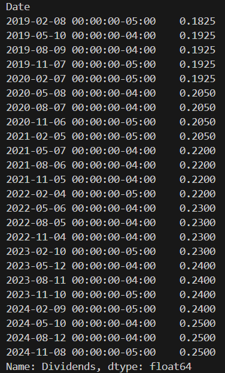

# yfinance Library Overview

The yfinance library allows users to interact with Yahoo Finance and retrieve a wide range of financial data for stock analysis. Below is a detailed breakdown of the key methods available for retrieving different types of financial data using the `Ticker` class.

## Setting Up yfinance 

1) Install yfinance via pip : To install the yfinance library, run the following command in your terminal or command prompt:

```
pip install yfinance
```

2) Once installed, you can retrieve stock data, historical prices, financials, and other key financial metrics. It starts by importing
 the library and begin using it to fetch data, for example : 

```
import yfinance as yf

# Define the ticker symbol for Apple
ticker = yf.Ticker("AAPL")

# Fetch the dividend data
dividends = ticker.dividends

# Filter the data for the desired date range (2019 to 2024)
dividends_2019_to_2024 = dividends['2019-01-01':'2024-12-31']

# Print the filtered dividend data
print(dividends_2019_to_2024)
```


It will print out similar to this : 



## Ticker Data Methods

Once you have a `Ticker` object, you can use various methods to retrieve different types of data for a specific stock symbol:

### 1. Historical Data
   - `ticker.history()`: Fetches historical market data for the stock.
     - Parameters:
       - `period` (e.g., `'1d'`, `'1mo'`, `'1y'`)
       - `interval` (e.g., `'1m'`, `'5m'`, `'1d'`, `'1wk'`)
       - `start`, `end` (specific date range)
   - `ticker.actions`: Returns dividends and stock splits.
   - `ticker.dividends`: Shows historical dividends data.
   - `ticker.splits`: Displays stock split history.

### 2. Financial Data
   - `ticker.financials`: Retrieves the most recent quarterly or annual income statements.
   - `ticker.quarterly_financials`: Similar to `ticker.financials`, but only for quarterly results.
   - `ticker.balance_sheet`: Provides the latest balance sheet information.
   - `ticker.quarterly_balance_sheet`: Latest quarterly balance sheet.
   - `ticker.cashflow`: Returns cash flow statements.
   - `ticker.quarterly_cashflow`: Quarterly cash flow statements.

### 3. Earnings Data
   - `ticker.earnings`: Shows annual earnings data.
   - `ticker.quarterly_earnings`: Displays quarterly earnings data.

### 4. Market Data & Analysis
   - `ticker.sustainability`: Returns environmental, social, and governance (ESG) risk scores.
   - `ticker.recommendations`: Shows analyst recommendations and ratings.
   - `ticker.calendar`: Provides important dates, such as earnings release dates.
   - `ticker.isin`: Returns the stock’s International Securities Identification Number (ISIN).
   - `ticker.options`: Provides expiration dates for options on the stock.
   - `ticker.option_chain(date)`: Retrieves call and put option data for a given expiration date.

### 5. Ownership Data
   - `ticker.major_holders`: Lists major shareholders.
   - `ticker.institutional_holders`: Lists institutional holders with their respective shares and values.
   - `ticker.mutualfund_holders`: Lists mutual fund holders.

## Fetching Multiple Tickers at Once

We can fetch data for multiple tickers simultaneously with the following method:

```python
data = yf.download(["AAPL", "MSFT", "GOOG"], start="2023-01-01", end="2023-12-31")
```

Parameters:
- tickers: List of stock symbols (e.g., ["AAPL", "MSFT", "GOOG"])
- start, end: Date range for the historical data.
- interval: Data frequency (e.g., '1d', '1wk').
- group_by: How the data is organized.
- auto_adjust: Adjusts for stock splits and dividends.
- threads: Enables multi-threading for faster data retrieval.

## Summary of Commonly Used yfinance Methods

1) Historical Data: .history(), .actions, .dividends, .splits
2) Fundamentals: .financials, .quarterly_financials, .balance_sheet, .quarterly_balance_sheet, .cashflow
3) Market Analysis: .recommendations, .sustainability, .calendar
4) Earnings: .earnings, .quarterly_earnings
5) Options: .options, .option_chain()
6) Ownership: .major_holders, .institutional_holders, .mutualfund_holders

These common methods could be helpful should there be use case in the future to further introduce new financial analytic features and improve the exsiting ones. 

## Testing and Performance Considerations

During initial testing, retrieving complete data for a single ticker took approximately 3-5 minutes. However, this was done for getting all the data available associated with a single ticker, and this time is reduced drastically by limiting the amount of data or the types of financial data retrieved.

## Further Research 

For more detailed information on the yfinance library, refer to the following resources:

https://pypi.org/project/yfinance/  
https://github.com/ranaroussi/yfinance 


