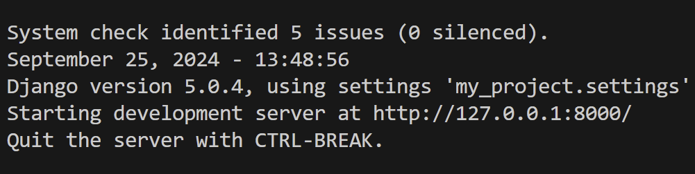

# Django Setup 

In order to setup django framework , it is recommended to use in virtual environment.

## Anaconda 

### Anaconda Download
Please download the required anaconda and run install :   

https://anaconda.org/anaconda/python 

### Anaconda Virtual Environment Setup 

1) Open Up Anaconda Terminal. 
2) Run ```conda create -n yourenvname python=3.11.7```
3) Activate ```conda activate yourenvname```

## Django

### Install Django 

With the virtual environment activated, run  
```pip install django```

### Create New Django Project 

To create a new django project, run  
```django-admin startproject finance_tool```  

This will create a directory called finance_tool with the necessary files and folders as shown in example in which: 

```finance_tool/
    manage.py
    finance_tool/
        __init__.py
        settings.py
        urls.py
        asgi.py
        wsgi.py
```  

__init__.py: Marks the directory as a package, enabling module imports and organization of code.
settings.py: Central configuration file for the project, containing settings related to debugging, database connections, installed apps, middleware, templates, static files, and allowed hosts.  

urls.py: Maps URL patterns to views, serving as the routing table for incoming requests and enabling dynamic routing.  

asgi.py: Entry point for ASGI applications, supporting asynchronous features like WebSockets for real-time applications.  

wsgi.py: Entry point for WSGI applications, allowing the project to be served by WSGI-compatible web servers, crucial for production deployment.

### Run The Development Server

First , navigate to my_project by running ```cd finance_tool``` 

Then, run the server by ```python manage.py runserver``` 

You should see an output in terminal indicating that the server is running, typically at http://127.0.0.1:8000 as shown : 




