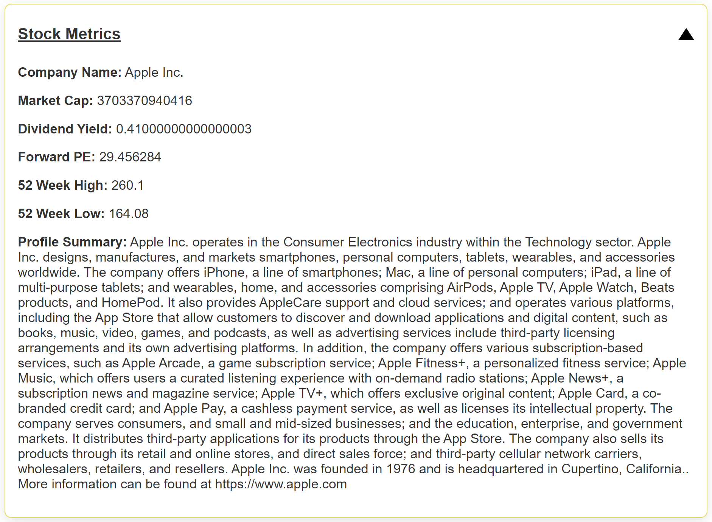
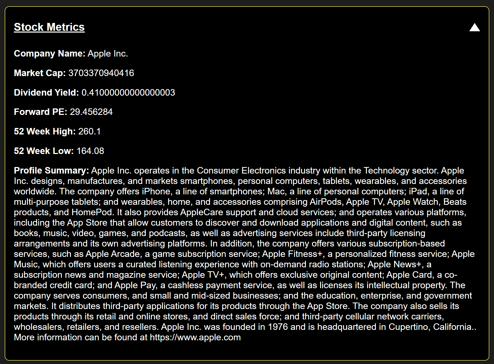

# Retrieving Company Profile & Related Key Matrices

The `get_stock_metrics_and_profile` function retrieves key stock metrics and company profile details using the Yahoo Finance API (`yfinance` library). It returns a dictionary of financial metrics and a formatted paragraph containing the company profile.

## Function 

```python
def get_stock_metrics_and_profile(ticker):
    stock = yf.Ticker(ticker)

    # Fetch the metrics
    metrics = {
        "Company Name": stock.info.get('longName', 'N/A'),
        "Market Cap": stock.info.get('marketCap', 'N/A'),
        "Dividend Yield": (stock.info.get('dividendYield', 'N/A') * 100) if stock.info.get('dividendYield') else 'N/A',
        "Forward PE": stock.info.get('forwardPE', 'N/A'),
        "52 Week High": stock.info.get('fiftyTwoWeekHigh', 'N/A'),
        "52 Week Low": stock.info.get('fiftyTwoWeekLow', 'N/A'),
    }

    # Retrieve company profile details
    company_profile = {
        "Profile": stock.info.get('longBusinessSummary', 'N/A'),
        "Website": stock.info.get('website', 'N/A'),
        "Industry": stock.info.get('industry', 'N/A'),
        "Sector": stock.info.get('sector', 'N/A'),
        "Headquarters": stock.info.get('address1', 'N/A'),
        "City": stock.info.get('city', 'N/A'),
        "State": stock.info.get('state', 'N/A'),
        "Country": stock.info.get('country', 'N/A'),
    }

    # Create a formatted paragraph for the company profile
    profile_paragraph = (
        f"{metrics['Company Name']} operates in the {company_profile['Industry']} industry within the {company_profile['Sector']} sector. "
        f"{company_profile['Profile']}.     More information can be found at {company_profile['Website']}"
    )

    return metrics, profile_paragraph
```

Parameters: 
- ticker (str): The stock ticker symbol for the company (e.g., "AAPL" for Apple, "GOOGL" for Google).
Returns
- metrics (dict): A dictionary containing key financial metrics for the company:

- Company Name: The full name of the company.
- Market Cap: The company's market capitalization.
- Dividend Yield: The company's dividend yield (percentage).
- Forward PE: The company's forward price-to-earnings ratio.
- 52 Week High: The highest price of the stock in the past 52 weeks.
- 52 Week Low: The lowest price of the stock in the past 52 weeks.
- profile_paragraph (str): A formatted string containing a brief company profile. This includes the company name, industry, sector, business summary, and website.

## Example Display 



